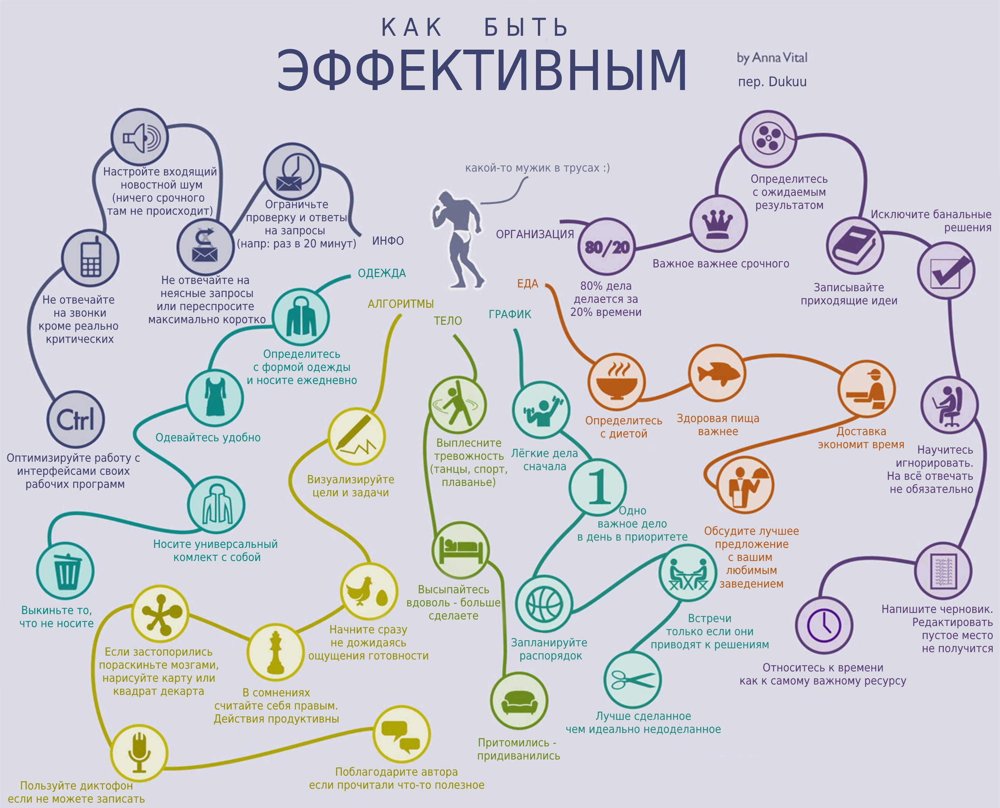

# Краткое содержание большинства книг по саморазвитию

Начиная с De tranquillitate animi («О душевном покое» или «О душевном спокойствии» Сенеки), люди писали про саморазвитие и то, как быть лучше. Но со времён Сенеки меняется только форма, в которой люди пишут про это, суть остаётся той же самой и её довольно легко передать в несколько картинках, что и сделал в своём ЖЖ skitalets.

Начиная с De tranquillitate animi («О душевном покое» или «О душевном спокойствии» Сенеки), люди писали про саморазвитие и то, как быть лучше. Но со времён Сенеки меняется только форма, в которой люди пишут про это, суть остаётся той же самой и её довольно легко передать в несколько картинках, что и сделал в своём ЖЖ [skitalets](https://skitalets.livejournal.com/102286.html).

1. Это про икигай, поиск себя, вместо того, чтобы работать, смысл жизни и как делать то, что нравится. 

2. Чем дальше ты двигаешься, тем больше дискомфорта в жизни возникнет, поскольку ты расширяешь зону контакта с неведомым. Эту картинку нарисовал Сократ, когда объяснял своему ученику, почему он не знает больше вещей, чем не знает его ученик. Просто его круг знаний больше, поэтому больше соприкасается с неведомым. 

3. Картинка объясняет, почему у нас есть правило 10000 часов и почему заканчивать что-то сложнее, чем начинать. Кто угодно может научиться водить машину, но стать в этом лучше — сложно. Чем лучше ты понимаешь тему, тем ты экспертнее и профессиональнее тех, кто бросил и не смог получить специфических навыков. 

4. Развитие происходит после каких-то событий, когда твои навыки улучшаются или ты это замечаешь. Спортсмены отмечают это после соревнований, в плане жизни это работает после каких-то потрясений или сложностей. 

5. Когда у тебя будет достаточное количество знаний и навыков, есть шанс поймать состояние "потока", когда работать будет в кайф. Поток - это когда отвечаешь на сложные вызовы высоким профессионализмом. То есть ты не сможешь его достичь, если ничего не умеешь. 

    Подробнее об этом можно почитать в краткой версии бестселлера "Поток".  
  
6. Весь тайм-менеджмент и куча лайфхаков в плане управления временем в одной картинке. 

7. «Чтобы успевать больше, помогает уже известное многим правило 80/20: мы тратим 20% усилий для достижения 80% результата. Если ему следовать в разумных пределах, то можно за 100% времени сделать в пять раз больше, чем остальные. Только надо не забыть потом все же результат хотя бы в одном из проектов до 100% довести.»

    Помимо этого, надо помнить, что чем больше ты работаешь в принципе, тем больше ты делаешь. Человек, который следует принципу 80/20 и работает 10 часов, сделает больше, чем тот, кто следует этому принципу и работает 5. Это очень коротко формулируется известным в среде любителей MMO-игр правиле: «пока ты спишь — враг качается».
    .jpg)
  
    Подробнее об этом можно почитать в краткой версии бестселлера ["Принцип 80/20"](https://smartreading.ru/summary/89).  
  
8. Очень важный урок, который автор оригинального поста приводит в этой картинке — важность общения и высказывания своей позиции. Если ты очень умный, но интраверт, тебя будут использовать. Сначала ты начинаешь говорить на совещаниях, а потом ты получаешь повышение. Без исключений. 
9. Среди чиновников есть честные эффективные профессионалы, которые не берут взяток и работают на совесть. В любой группе людей есть вспыльчивые и несдержанные. В жизни нет ничего дискретного — чёрного и белого —есть очень большая середина и очень немногочисленные "концы". Но в этих хвостах распределения часто прячутся очень интересные вещи. 
10. В математике есть понятие «марковского процесса». Основная мысль в том, что состояние в текущий момент времени для него случайно и не зависит от прошлого. Если сегодня идёт дождь, это не гарантирует того, что завтра будет дождь или солнце.

    В жизни прошлое напрямую не влияет на будущее, и каждый момент под названием «настоящее» является потенциальной точкой изменения жизненной траектории. В каком направлении она пойдет завтра - это твой собственный выбор.

    Чтобы до конца понять эту картинку нужно представить себе прошлое и будущее не как линию, которая идёт слева направо, а как будто ты идёшь по дороге. Прошлое — это то, что ты прошёл и находится за спиной, а будущее — это та часть дороги, которую тебе предстоит пройти.

    Попробуй пройтись по улице, постоянно оглядываясь назад, чтобы понять, как глупо жить в прошлом.

11. Помимо этого, никогда не поздно начинать. В интернетах гуляет популярная картинка про людей, которые основали большие компании. История полковника Сандерса и KFC и других компаний. Изначально эта инфографика была нарисована в результате исследования Founders Institute, теперь для неё есть интерактивная [промо-страничка](https://blog.adioma.com/too-late-to-start-life-crisis-infographic/). 
12. Наш сервис Smart Reading, который публикует краткие содержания книг, подготовил отличную инфографику, которая раскрывает смысл книги [«7 навыков высокоэффективных людей»](https://smartreading.ru/summary/60) в одной картинке. Первый совет один из самых ценных — переживайте только по тому поводу, на который вы можете повлиять и не обсуждайте политику. 
13. Ещё одна инфографика: 

15. Как формируется привычка: Триггер — Действие — Вознаграждение 

## Ссылки

* [Источник](https://blog.smartreading.ru/975)
* [Эффективность](Эффективность.md)
